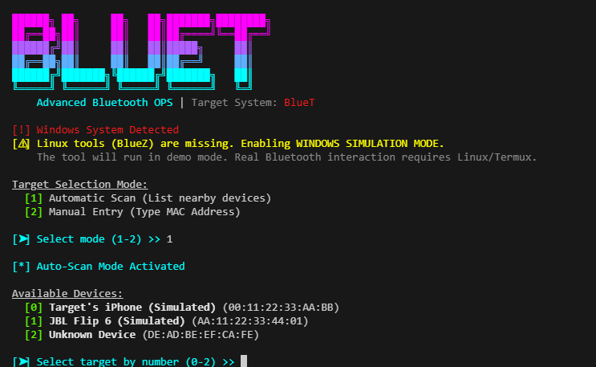

# BlueT - Advanced Bluetooth Offensive Suite



**BlueT** (formerly BlueSpy) is an advanced Bluetooth offensive tool designed for security assessment and proof-of-concept demonstrations. It allows you to simulate and perform various Bluetooth operations such as recording audio, dumping device info, and launching denial-of-service attacks.

---

## 🚀 Key Features

*   **Audio Spying:** Record audio from a target's microphone without their knowledge (requires vulnerable pairing).
*   **DoS Attack (L2Ping Flood):** Overwhelm a target device with huge packets to cause lag or disconnection.
*   **Signal Radar:** Real-time signal strength (RSSI) tracking to physically locate devices.
*   **Service Discovery:** Enumerate running services (SDP) on the target.
*   **Data Dump:** Retrieve **SMS** and **Call Logs** (requires OBEX access).
*   **Vulnerability Scan:** Check for BlueBorne, BIAS, and KNOB vulnerabilities.
*   **Interactive Shell:** Easy-to-use menu system for selecting attacks.

---

## 💻 Installation & Requirements

### Linux (Kali/Ubuntu/Arch)
Build on standard Linux tools.
```bash
# Install dependencies
sudo apt update
sudo apt install python3 bluez-tools pulseaudio-utils obexftp bluetooth
# (On Arch: sudo pacman -S bluez bluez-utils pulseaudio obexftp)

# Clone & Run
git clone https://github.com/manigpj/BlueT.git
cd BlueT
sudo python3 BlueT.py
```

### Windows (Simulation Mode)
On Windows, the tool runs in **Simulation Mode**. This means no real Bluetooth attacks will happen, but you can explore the UI and testing flow.
```bash
python BlueT.py
```

---

## 📱 Termux Guide (Android)

To run **BlueT** with real functionality on Android, you need **Termux** and a **ROOTED** device. Without root, you cannot access the Bluetooth stack directly.

### 1. Install Termux & Dependencies
Open Termux and run the following commands one by one:

```bash
# 1. Update repositories
pkg update && pkg upgrade -y

# 2. Install Root Repo & Tools
pkg install root-repo
pkg install tsu python bluez-utils pulseaudio

# 3. (Optional) Install ObexFTP for SMS/Call Dump (if available or compile manually)
# pkg install obexftp 
```

### 2. Grant Root Permissions
BlueT requires root to control the Bluetooth adapter (`hci0`).
```bash
# Switch to root user
tsu
```

### 3. Run BlueT
Navigate to the tool directory and run it with Python:
```bash
# Go to directory (example)
cd /sdcard/Download/BlueT

# Run the tool
python BlueT.py
```

### 4. Troubleshooting on Termux
*   **"No module named..."**: Run `pip install -r requirements.txt` (if applicable) or ensure you are in the right python environment.
*   **"No adapter found"**: Ensure Bluetooth is ON in Android settings. Sometimes you need to stop the Android Bluetooth service to let Termux take over:
    ```bash
    # Stop Android Bluetooth Stack (Advanced)
    /system/bin/service call bluetooth_manager 8
    ```
    *Warning: This might freeze your phone or require a reboot to fix Bluetooth.*

---

## ⚡ Quick Start Summary

### 1️⃣ Setup (Termux)
```bash
pkg install python tsu termux-api
# Root User (For Advanced Features)
tsu
python BlueT.py
```

### 2️⃣ Usage Guide
1.  **Run Tool:** Execute `python BlueT.py`.
2.  **Select Mode:**
    *   `[1] Auto Scan`: Find nearby devices automatically.
    *   `[2] Manual Entry`: Enter MAC Address directly if known.
3.  **Choose Attack (Main Menu):**
    *   🎙️ **Spy (`1`)**: Listen to microphone (Record Audio).
    *   📡 **Radar (`5`)**: Track device distance (Signal Strength).
    *   💥 **DoS (`3`)**: Flood/Crash the device (Linux/Root Only).
    *   📩 **Dump (`7/8`)**: Extract SMS & Call Logs (Linux/Root Only).

**Note:** On Non-Root Termux, only Scan, Record, and Radar features are available. DoS and Dump require Root access.

---

## 🎮 How to Use

1.  **Start the Tool**:
    ```bash
    sudo python3 BlueT.py
    ```
2.  **Select a Target**:
    *   The tool will automatically scan for nearby devices.
    *   Enter the number corresponding to your target (e.g., `0`, `1`).
3.  **Choose an Attack**:
    *   Once connected, you will see the **Attack Menu**:
        *   `[1] Record Audio`: Spies on the microphone.
        *   `[2] Dump Device Info`: Shows battery, class, RSSI.
        *   `[3] DoS Attack`: Launches packet flood.
        *   `[4] Service Discovery`: Lists open ports/services.
        *   `[5] Signal Radar`: Tracks distance to device.
        *   `[6] Vuln Scan`: Checks for known exploits.
        *   `[7] Dump SMS`: Extracts message history.
        *   `[8] Dump Call Logs`: Extracts call history.
4.  **Exit**:
    *   Press `9` or `Ctrl+C` to stop.

---

## ⚠️ Disclaimer
This tool is for **EDUCATIONAL PURPOSES ONLY**. Do not use it on devices you do not own or have permission to test. The authors are not responsible for any misuse.
